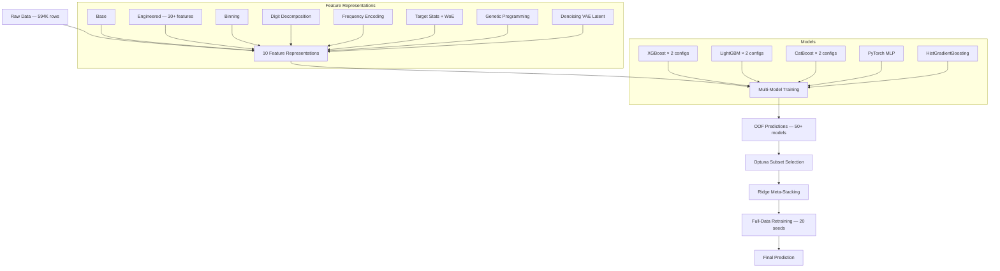

# Customer Churn Prediction — Kaggle Playground S6E3

[](https://python.org)
[](LICENSE)
[](https://www.kaggle.com/competitions/playground-series-s6e3)

Advanced ensemble ML pipeline for predicting customer churn on the Telco Customer Churn dataset (594K samples). Progressive pipeline evolution from simple baseline to champion-level stacking solution.

**Kaggle LB: 0.91587 AUC | #315 | OOF CV: 0.91745**

## Architecture



## Pipeline Versions

| Version | Key Innovation | CV AUC | LB AUC |
|---------|---------------|--------|--------|
| **Simple** | Ridge stacking with 6 base models | ~0.860 | — |
| **v4** | 10-fold CV, multi-seed, Optuna tuning | ~0.868 | — |
| **v5** | PyTorch MLP, pseudo-labeling, feature diversity | ~0.873 | — |
| **v6** | 7 feature representations, 28+ OOF models, Ridge meta | ~0.878 | — |
| **v7** | GP + VAE + 10 representations + 69 OOF pool | 0.917 | — |
| **v7-light** | v7 without GP/VAE, 28/69 OOF selected, pseudo-labeling | **0.91745** | **0.91587** |

## Final Results (v7-light on Kaggle)

- **69 OOF models** generated across 5 model families (XGBoost, LightGBM, CatBoost, HGB, MLP)
- **Optuna** selected 28/69 best OOF subset (500 trials)
- **Ridge meta-stacking** (alpha=50) achieved 0.91745 CV AUC
- **Pseudo-labeling** applied to top 3 digit-representation models (29.7% of test data)
- **Leaderboard**: #315 with 0.91587 public AUC

## Key Techniques

- **Multi-Representation Learning** — 8 different feature views of the same data
- **OOF Pooling & Selection** — Generate 69 predictions, select best 28 via Optuna
- **Ridge Stacking** — Robust meta-model that beats complex alternatives
- **Full-Data Retraining** — 2-seed averaged predictions after OOF selection
- **KFold-Safe Pipelines** — All feature engineering respects fold splits
- **Genetic Programming** — Evolve symbolic features with gplearn (v7 full)
- **Denoising VAE** — Extract latent representations with PyTorch autoencoder (v7 full)
- **Pseudo-Labeling** — Semi-supervised boost with high-confidence predictions

## Quick Start

```bash
# Clone
git clone https://github.com/ekremkutukculer/customer-churn-prediction.git
cd customer-churn-prediction

# Install dependencies
pip install -r requirements.txt

# Download data from Kaggle
# Place train.csv, test.csv, sample_submission.csv in data/

# Run the champion pipeline
python kaggle_churn_v7_light.py
```

## Feature Engineering

| Representation | Description |
|----------------|-------------|
| BASE | Label-encoded categoricals |
| ENGINEERED | 30+ derived features (service counts, financial ratios, tenure groups) |
| BINNING | Quantile and equal-width bins for numerical features |
| DIGIT | Digit decomposition (units, tens, hundreds) |
| ALL_CATS | All features as categorical strings |
| FREQUENCY | Normalized value counts encoding |
| ORIG_STATS | Target mean, smoothed mean, Weight of Evidence from original data |
| GP_FEATURES | Genetic programming symbolic expressions |
| DVAE | Denoising VAE latent dimensions |
| FULL | Concatenation of all representations |

## Models

| Model | Role |
|-------|------|
| XGBoost | Primary tree model (2 configs: conservative & aggressive) |
| LightGBM | Fast tree model + DART variant |
| CatBoost | Native categorical handling |
| HistGradientBoosting | Sklearn's gradient boosting |
| PyTorch MLP | 3-layer neural network (256→128→64) |
| Ridge Regression | Meta-stacking model |

## Dataset

- **Source**: [Kaggle Playground Series S6E3](https://www.kaggle.com/competitions/playground-series-s6e3)
- **Size**: 594K training + 255K test samples
- **Features**: 20 (demographics, services, contract, billing)
- **Target**: Binary churn (22.5% churn rate)
- **Original**: IBM Telco Customer Churn dataset

## Tech Stack

- **ML**: XGBoost, LightGBM, CatBoost, scikit-learn
- **Deep Learning**: PyTorch (MLP + VAE)
- **Optimization**: Optuna, SciPy (Nelder-Mead)
- **Feature Engineering**: gplearn (genetic programming)
- **Data**: Pandas, NumPy

## Project Structure

```
├── kaggle_churn_v7_light.py  # Champion pipeline (0.91587 LB)
├── data/                     # Kaggle dataset (gitignored)
├── requirements.txt
└── LICENSE
```

## License

MIT — see [LICENSE](LICENSE) for details.

---

Built by [@ekremkutukculer](https://github.com/ekremkutukculer)
